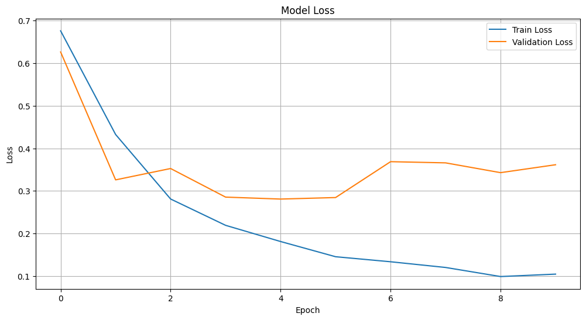
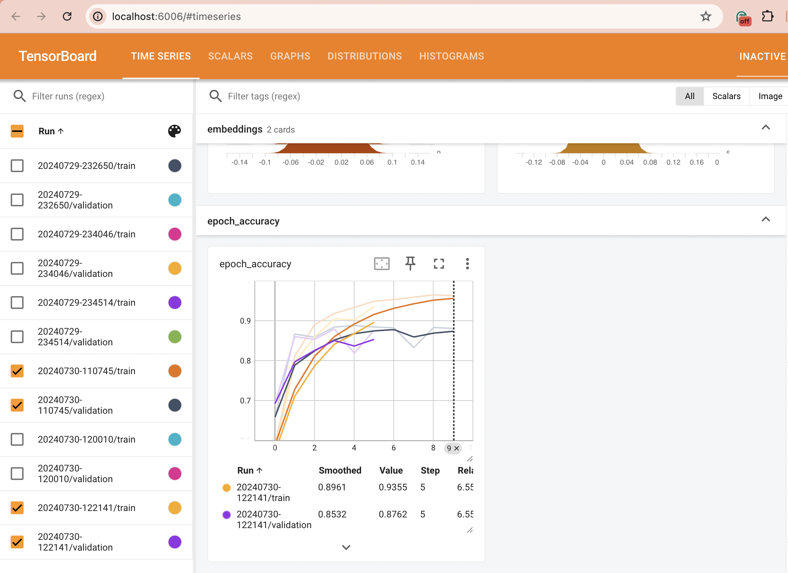
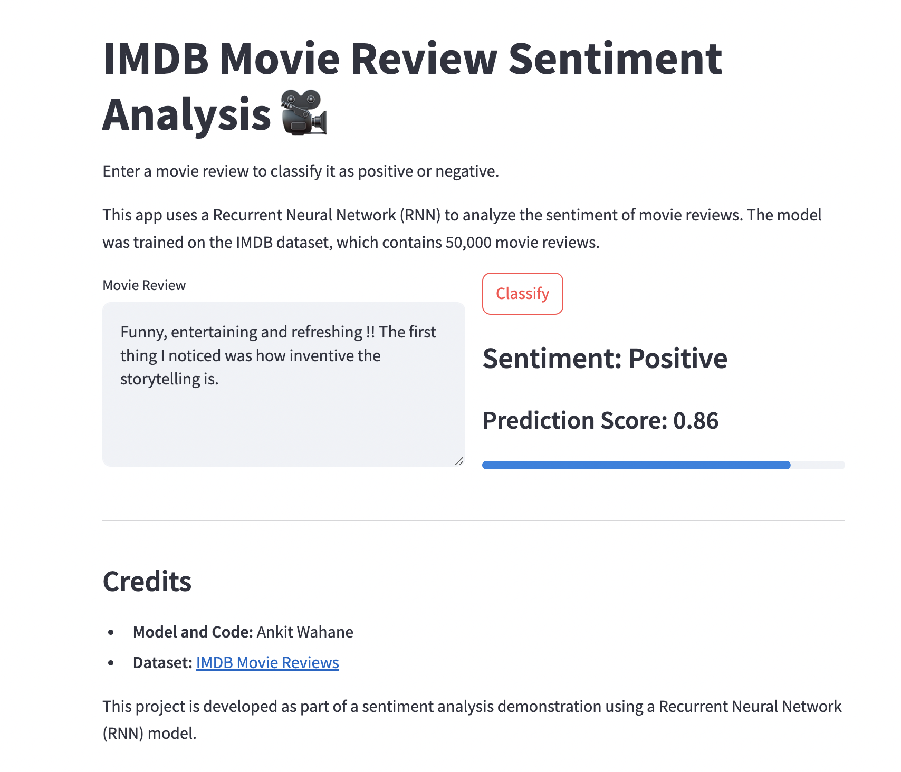
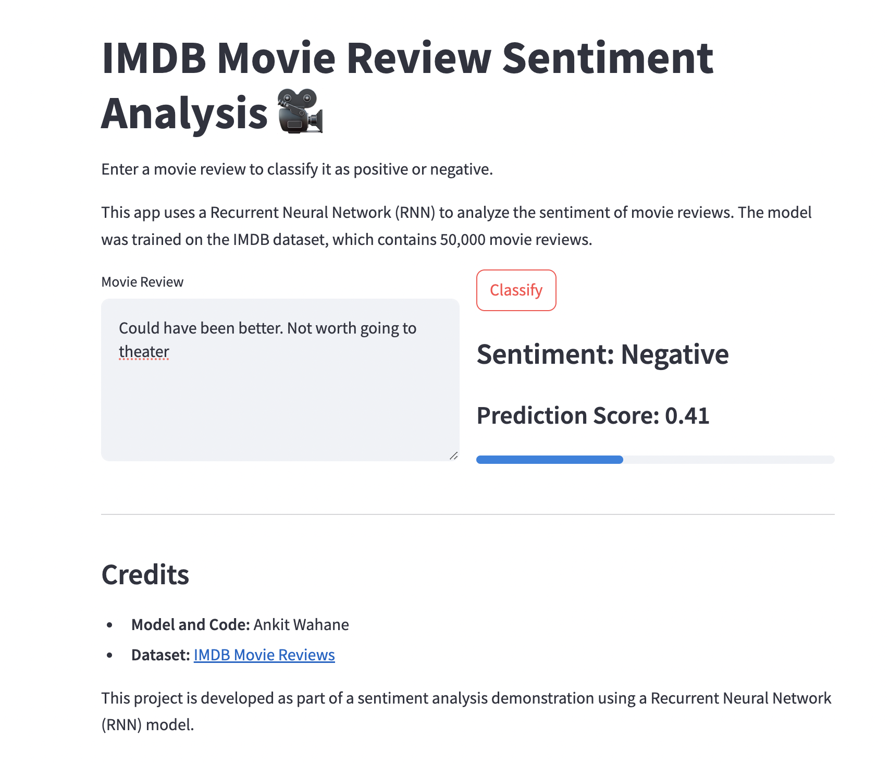

#               IMDB Movie Review Sentiment Analysis

 <div style="display: flex; justify-content: space-around;">
  
</div>

This project demonstrates sentiment analysis of IMDB movie reviews using a Recurrent Neural Network (RNN) model. The project consists of Jupyter notebooks explaining different steps, a trained model, and a Streamlit app for interactive predictions.

## Project Structure

- **0_embedding.ipynb**: Explains how the embedding layer works and how it generates vectors with a given number of dimensions.
- **1_Simple_RNN.ipynb**: Training a Simple RNN model on the IMDB dataset.
- **2_Prediction.ipynb**: Loading the trained RNN model and making predictions.
- **app.py**: Code for the Streamlit app.

## Installation

1. Clone the repository:
    ```bash
    git clone https://github.com/your_username/Simple-RNN.git
    cd Simple-RNN
    ```

2. Create a virtual environment and activate it:
    ```bash
    python3 -m venv .venv
    source .venv/bin/activate  # On Windows use `.venv\Scripts\activate`
    ```

3. Install the required packages:
    ```bash
    pip install -r requirements.txt
    ```

## Training the Model

Run the `1_Simple_RNN.ipynb` notebook to train the model. The training process will produce a train vs validation loss graph.

 <div style="display: flex; justify-content: space-around;">
  
</div>

## Running TensorBoard

To visualize the training process with TensorBoard, run the following command:
```bash
tensorboard --logdir=logs/fit
```

 <div style="display: flex; justify-content: space-around;">
  
</div>

## Making Predictions

Run the 2_Prediction.ipynb notebook to load the trained RNN model and make predictions on new movie reviews. This notebook demonstrates how to preprocess new reviews, load the model, and use it to predict the sentiment.

## Streamlit APP

To run the Streamlit app for interactive sentiment analysis, use the following command:
```bash
streamlit run app.py
```
 <div style="display: flex; justify-content: space-around;">
  
  
</div>

### Credits

- **Model and Code:** Ankit Wahane
- **Dataset:** [IMDB Movie Reviews](https://ai.stanford.edu/~amaas/data/sentiment/)
- **Header Image:** Generated using OpenAI's DALL-E
- **Course:** Part of GenAI end to end course by Krish Naik
